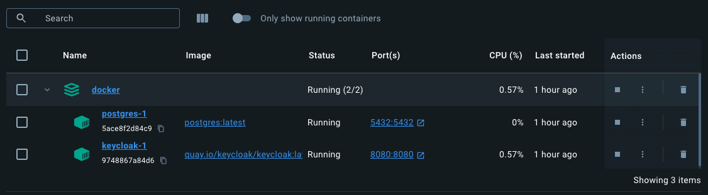

# Keycloak Notes
- **Keycloak**:
  - open-source platform (server) 
  - centrally manage user identities and access to applications
- **Realms**: 
  - Allow an administrator to create isolated groups of applications and users 
  - Keycloak describes the realms as tenants in Keycloak

# Getting Started

### Reference Documentation
For further reference, please consider the following sections:

* [Official Gradle documentation](https://docs.gradle.org)
* [Spring Boot Gradle Plugin Reference Guide](https://docs.spring.io/spring-boot/docs/3.3.1/gradle-plugin/reference/html/)
* [Create an OCI image](https://docs.spring.io/spring-boot/docs/3.3.1/gradle-plugin/reference/html/#build-image)
* [Spring Web](https://docs.spring.io/spring-boot/docs/3.3.1/reference/htmlsingle/index.html#web)
* [Spring Security](https://docs.spring.io/spring-boot/docs/3.3.1/reference/htmlsingle/index.html#web.security)
* [OAuth2 Client](https://docs.spring.io/spring-boot/docs/3.3.1/reference/htmlsingle/index.html#web.security.oauth2.client)

### Guides
The following guides illustrate how to use some features concretely:

* [Building a RESTful Web Service](https://spring.io/guides/gs/rest-service/)
* [Serving Web Content with Spring MVC](https://spring.io/guides/gs/serving-web-content/)
* [Building REST services with Spring](https://spring.io/guides/tutorials/rest/)
* [Securing a Web Application](https://spring.io/guides/gs/securing-web/)
* [Spring Boot and OAuth2](https://spring.io/guides/tutorials/spring-boot-oauth2/)
* [Authenticating a User with LDAP](https://spring.io/guides/gs/authenticating-ldap/)

### CONFIGURATION 
- KeyCloak server configuration:
  - REALM: `NickApplication`
  - Clients: `external-client`
    - valid redirect URIs: `http://localhost:8090/*` (server host + port) 
    - roles: admin & user
  - Users:
    - user1: admin role
    - user2: user role
    - user3: both admin & user role
  - Notes:
    - To avoid error **"Account is not fully set up"**, I will turn off the `Verify Profile` actions inside **Authentication** settings -> *Required actions tab*

- To get the `token_enpoint`, navigate to **Realm Settings -> OpenID Endpoint Configuration** then get the value from `token_endpont`. In my case, it is: http://localhost:8080/realms/NickApplication/protocol/openid-connect/token
- Need to setup to request body to get the token:
  - `grant_type`: `password`
  - `client_id`: `external-client`
  - `username`: `user1`
  - `password`: `1234`

- After get the token, input to `Authorization` with BearerToken
### DEMO
- 2 containers: 

- KeyCloak server: `localhost:8080/admin`
- App server: `localhost:8090`
- 3 APIs endpoints: 
  - `/api/nick`: public access
  - `/api/admin`: only admin access
  - `/api/user`: only user can access

### Additional Links
These additional references should also help you:

* [Gradle Build Scans – insights for your project's build](https://scans.gradle.com#gradle)

